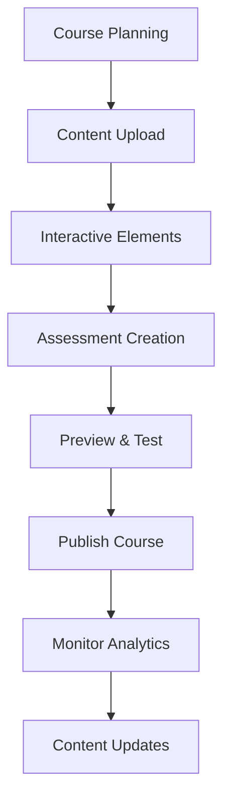

# 🎓 SkillForge Academy
### *A Modern E-Learning Platform Built with ASP.NET Core Multi-Pattern Architecture*

---

## 🌟 App Vision

**SkillForge Academy** is a comprehensive online learning platform that revolutionizes education through interactive courses, real-time collaboration, and AI-powered learning analytics. Built using ASP.NET Core's flexible architecture, it demonstrates the perfect harmony between MVC, Razor Pages, Minimal APIs, and traditional API Controllers.

## 🎯 Mission Statement

*"Empowering learners worldwide through personalized, interactive, and accessible education technology that adapts to every learning style and pace."*

---

## 🏗️ Application Architecture

### Multi-Pattern Implementation Strategy

#### 🖥️ **MVC Pattern** - Admin Dashboard & Instructor Portal
- **Complex UI Management**: Rich admin interfaces with multiple data sources
- **Dashboard Analytics**: Interactive charts and reports for course performance
- **Content Management**: Advanced course creation and editing interfaces
- **User Management**: Comprehensive admin controls for users, roles, and permissions

#### 📄 **Razor Pages** - Public-Facing Website
- **Landing Pages**: Marketing and informational pages
- **User Authentication**: Login, registration, and profile management
- **Course Catalog**: Browse and search course listings
- **Simple Forms**: Contact us, newsletter signup, feedback forms

#### ⚡ **Minimal APIs** - Real-time Features
- **Live Chat**: WebSocket connections for real-time messaging
- **Notifications**: Push notifications and alerts
- **Health Checks**: System monitoring and status endpoints
- **File Upload**: Quick file processing for assignments and media

#### 🔧 **API Controllers** - Mobile App & Third-party Integration
- **RESTful Services**: Full CRUD operations for mobile app
- **Authentication API**: JWT-based authentication for external apps
- **Learning Analytics**: Complex data processing and reporting
- **Integration Hub**: Third-party service integrations (payment, email, etc.)

---

## 🚀 Core Features

### 📚 **Learning Management System**
- **Interactive Courses**: Video lectures, quizzes, assignments, and projects
- **Progress Tracking**: Real-time learning analytics and completion status
- **Adaptive Learning**: AI-powered content recommendations
- **Certification System**: Digital certificates and skill badges

### 👥 **Multi-User Experience**
- **Students**: Personalized learning dashboard and course access
- **Instructors**: Course creation tools and student management
- **Administrators**: Platform management and analytics oversight
- **Content Reviewers**: Quality assurance and content approval workflow

### 💬 **Collaboration Tools**
- **Discussion Forums**: Course-specific and general discussion boards
- **Live Sessions**: Virtual classrooms with video conferencing
- **Study Groups**: Student-created collaborative learning spaces
- **Peer Review**: Assignment and project peer evaluation system

### 📊 **Advanced Analytics**
- **Learning Analytics**: Detailed insights into learning patterns
- **Performance Metrics**: Course completion rates and assessment scores
- **Engagement Tracking**: Time spent, interaction patterns, and participation
- **Predictive Analytics**: Early intervention for at-risk students

---

## 🛠️ Technology Stack

### **Backend Architecture**
- **Framework**: ASP.NET Core 9.0
- **Database**: SQL Server with Entity Framework Core
- **Caching**: Redis for session management and performance
- **Search**: Elasticsearch for course and content search
- **Media Storage**: Azure Blob Storage for videos and documents

### **Frontend Technologies**
- **Web UI**: Bootstrap 5, jQuery, Chart.js for analytics
- **Real-time**: SignalR for live features
- **Video Player**: Video.js for course content delivery
- **File Upload**: Dropzone.js for drag-and-drop functionality

### **Mobile & API**
- **Mobile Apps**: Xamarin/MAUI consuming REST APIs
- **API Documentation**: Swagger/OpenAPI specification
- **Authentication**: JWT tokens with refresh token support
- **Rate Limiting**: API throttling and usage analytics

### **DevOps & Infrastructure**
- **Containerization**: Docker with Kubernetes orchestration
- **CI/CD**: GitHub Actions for automated deployment
- **Monitoring**: Application Insights and custom logging
- **CDN**: Azure CDN for global content delivery

---

## 📱 Platform Interfaces

### 🌐 **Web Application** (MVC + Razor Pages)

#### **Student Portal** (MVC)
```
🏠 Dashboard
├── 📊 Learning Progress
├── 📚 My Courses
├── 🎯 Recommendations
├── 📅 Schedule
└── 🏆 Achievements

📖 Course Player
├── 🎥 Video Lectures
├── 📝 Interactive Notes
├── ❓ Quizzes & Assessments
├── 📋 Assignments
└── 💬 Discussion Forum
```

#### **Instructor Dashboard** (MVC)
```
👨‍🏫 Instructor Hub
├── 📈 Course Analytics
├── 🎬 Content Creation
├── 👥 Student Management
├── 📊 Performance Reports
└── 💰 Earnings Overview

🛠️ Course Builder
├── 📹 Video Upload & Processing
├── 📝 Lesson Planning
├── 🧪 Quiz & Assignment Creator
├── 📚 Resource Library
└── 🎨 Course Customization
```

#### **Public Pages** (Razor Pages)
```
🌍 Public Site
├── 🏠 Homepage
├── 📚 Course Catalog
├── 🔍 Search & Filter
├── 👤 User Registration/Login
├── 💳 Pricing & Plans
├── 📞 Contact & Support
└── 📰 Blog & News
```

### 📱 **Mobile Application** (API Controllers)

#### **Core Features**
- **Offline Learning**: Download courses for offline access
- **Push Notifications**: Assignment reminders and course updates
- **Mobile Payments**: In-app purchase integration
- **Social Learning**: Share progress and collaborate with peers

#### **API Endpoints**
```http
# Authentication
POST /api/auth/login
POST /api/auth/register
POST /api/auth/refresh

# Courses
GET /api/courses
GET /api/courses/{id}
POST /api/courses/{id}/enroll
GET /api/courses/{id}/progress

# Learning
GET /api/lessons/{id}
POST /api/lessons/{id}/complete
GET /api/quizzes/{id}
POST /api/quizzes/{id}/submit

# User Profile
GET /api/profile
PUT /api/profile
GET /api/profile/achievements
```

### ⚡ **Real-time Features** (Minimal APIs)

#### **Live Learning**
```http
# WebSocket Connections
GET /live/chat/{courseId}
GET /live/classroom/{sessionId}
GET /live/notifications/{userId}

# Quick Actions
POST /quick/like/{contentId}
POST /quick/bookmark/{lessonId}
GET /status/health
GET /status/metrics
```

---

## 🗄️ Database Schema

### **Core Entities**

#### **User Management**
```sql
Users (Identity Integration)
├── AspNetUsers (Extended)
├── UserProfiles
├── UserPreferences
└── UserAchievements

Roles & Permissions
├── AspNetRoles
├── CoursePermissions
└── InstructorApplications
```

#### **Learning Content**
```sql
Courses
├── CourseId, Title, Description
├── InstructorId, CategoryId
├── Price, Duration, Level
└── CreatedAt, UpdatedAt

Lessons
├── LessonId, CourseId, Title
├── VideoUrl, Content, Duration
├── OrderIndex, IsPreview
└── Resources, Attachments

Assessments
├── QuizId, LessonId, Type
├── Questions, Options, Answers
├── PassingScore, TimeLimit
└── Attempts, Retakes
```

#### **Learning Analytics**
```sql
Enrollments
├── EnrollmentId, UserId, CourseId
├── EnrolledAt, Progress, Status
├── LastAccessedAt, CompletedAt
└── CertificateIssued

LearningProgress
├── ProgressId, UserId, LessonId
├── Status, TimeSpent, Score
├── StartedAt, CompletedAt
└── Notes, Bookmarks

Analytics
├── SessionId, UserId, ActionType
├── ContentId, Timestamp
├── Duration, DeviceInfo
└── IPAddress, UserAgent
```

---

## 🎨 User Experience Design

### 🎯 **Student Journey**

#### **Discovery Phase**
1. **Landing Page** → Browse featured courses and categories
2. **Course Preview** → Watch preview videos and read descriptions
3. **Registration** → Quick signup with email or social login
4. **Course Selection** → Filter by skill level, duration, and price

#### **Learning Phase**
1. **Personalized Dashboard** → Track progress and upcoming deadlines
2. **Interactive Learning** → Video lectures with note-taking and bookmarks
3. **Practice & Assessment** → Quizzes, assignments, and hands-on projects
4. **Community Engagement** → Discussion forums and study groups

#### **Achievement Phase**
1. **Progress Tracking** → Visual progress indicators and milestones
2. **Skill Validation** → Certificates and digital badges
3. **Career Advancement** → LinkedIn integration and job matching
4. **Continuous Learning** → Personalized course recommendations

### 👨‍🏫 **Instructor Experience**

#### **Content Creation Workflow**


#### **Teaching Tools**
- **Video Studio**: Built-in recording and editing capabilities
- **Interactive Builder**: Drag-and-drop quiz and assignment creator
- **Analytics Dashboard**: Real-time student engagement metrics
- **Communication Hub**: Direct messaging and announcement system

---

## 🔧 Technical Implementation

### **Architecture Patterns by Feature**

#### **MVC Implementation**
```csharp
// Controllers/CourseController.cs
public class CourseController : Controller
{
    [HttpGet]
    public async Task<IActionResult> Dashboard()
    {
        var viewModel = new CourseDashboardViewModel
        {
            Courses = await _courseService.GetInstructorCoursesAsync(UserId),
            Analytics = await _analyticsService.GetCourseAnalyticsAsync(UserId),
            RecentActivity = await _activityService.GetRecentActivityAsync(UserId)
        };
        return View(viewModel);
    }
    
    [HttpPost]
    public async Task<IActionResult> CreateCourse(CourseCreateViewModel model)
    {
        if (ModelState.IsValid)
        {
            await _courseService.CreateCourseAsync(model, UserId);
            return RedirectToAction(nameof(Dashboard));
        }
        return View(model);
    }
}
```

#### **Razor Pages Implementation**
```csharp
// Pages/Catalog/Index.cshtml.cs
public class IndexModel : PageModel
{
    [BindProperty(SupportsGet = true)]
    public CourseSearchRequest SearchRequest { get; set; } = new();
    
    public PagedResponse<CourseDto> Courses { get; set; } = new();
    public List<CategoryDto> Categories { get; set; } = new();
    
    public async Task OnGetAsync()
    {
        Categories = await _catalogService.GetCategoriesAsync();
        Courses = await _catalogService.SearchCoursesAsync(SearchRequest);
    }
}
```

#### **Minimal APIs Implementation**
```csharp
// Program.cs - Minimal APIs
app.MapGet("/api/health", () => Results.Ok(new { Status = "Healthy", Timestamp = DateTime.UtcNow }));

app.MapPost("/api/quick/enroll/{courseId:int}", async (int courseId, IEnrollmentService service, ClaimsPrincipal user) =>
{
    var userId = user.GetUserId();
    var result = await service.QuickEnrollAsync(courseId, userId);
    return result.Success ? Results.Ok(result) : Results.BadRequest(result);
});

app.MapHub<LearningHub>("/hubs/learning");
```

#### **API Controllers Implementation**
```csharp
// Controllers/Api/LearningApiController.cs
[ApiController]
[Route("api/[controller]")]
public class LearningApiController : ControllerBase
{
    [HttpGet("courses/{courseId}/progress")]
    public async Task<ActionResult<LearningProgressDto>> GetProgress(int courseId)
    {
        var userId = User.GetUserId();
        var progress = await _learningService.GetProgressAsync(courseId, userId);
        return Ok(ApiResponse<LearningProgressDto>.SuccessResult(progress));
    }
    
    [HttpPost("lessons/{lessonId}/complete")]
    public async Task<ActionResult<ApiResponse<bool>>> CompleteLesson(int lessonId, [FromBody] LessonCompletionRequest request)
    {
        var userId = User.GetUserId();
        var result = await _learningService.CompleteLessonAsync(lessonId, userId, request);
        return Ok(ApiResponse<bool>.SuccessResult(result));
    }
}
```

---

## 💰 Business Model

### **Revenue Streams**

#### **Freemium Model**
- **Free Tier**: Limited course access and basic features
- **Premium Subscription**: Unlimited access and advanced features
- **Enterprise Plans**: Custom solutions for organizations

#### **Marketplace Model**
- **Course Sales**: Revenue sharing with instructors (70/30 split)
- **Certification Fees**: Premium certificates and skill assessments
- **Corporate Training**: Custom course development and training programs

#### **Value-Added Services**
- **1-on-1 Mentoring**: Direct instructor consultation
- **Career Services**: Resume reviews and job placement assistance
- **API Licensing**: White-label solutions for educational institutions

### **Pricing Strategy**
```
💎 Premium Individual - $29/month
├── ✅ Unlimited course access
├── ✅ Offline mobile learning
├── ✅ Certificates of completion
├── ✅ Priority support
└── ✅ Advanced analytics

🏢 Enterprise - Custom Pricing
├── ✅ Team management tools
├── ✅ Custom branding options
├── ✅ Advanced reporting
├── ✅ SSO integration
└── ✅ Dedicated support
```

---

## 📈 Growth Strategy

### **Phase 1: MVP Launch** (Months 1-3)
- Core learning platform with basic courses
- User registration and course enrollment
- Simple progress tracking and certificates
- Mobile-responsive web application

### **Phase 2: Enhanced Features** (Months 4-6)
- Native mobile applications
- Live streaming and virtual classrooms
- Advanced analytics and reporting
- Integration with popular tools (Slack, Zoom)

### **Phase 3: AI & Personalization** (Months 7-12)
- AI-powered content recommendations
- Adaptive learning paths
- Automated content creation tools
- Advanced proctoring and assessment

### **Phase 4: Ecosystem Expansion** (Year 2+)
- Marketplace for third-party content
- Corporate university solutions
- International localization
- VR/AR learning experiences

---

## 🔒 Security & Compliance

### **Data Protection**
- **GDPR Compliance**: User data privacy and right to deletion
- **FERPA Compliance**: Educational record protection
- **SOC 2 Type II**: Security and availability controls
- **End-to-End Encryption**: Sensitive data protection

### **Authentication & Authorization**
- **Multi-Factor Authentication**: Enhanced account security
- **Role-Based Access Control**: Granular permission system
- **API Security**: JWT tokens with proper expiration
- **Content Protection**: DRM for premium video content

---

## 🌍 Market Opportunity

### **Target Market Size**
- **Global E-Learning Market**: $400+ billion by 2026
- **Online Course Market**: 15% annual growth rate
- **Mobile Learning**: 25% of total e-learning market
- **Corporate Training**: $360 billion market opportunity

### **Competitive Advantages**
- **Multi-Platform Architecture**: Web, mobile, and API-first approach
- **Real-time Collaboration**: Live learning and instant feedback
- **AI-Powered Personalization**: Adaptive learning experiences
- **Developer-Friendly**: Extensive API for third-party integrations

---

## 🚀 Getting Started

### **For Developers**

#### **1. Development Setup**
```bash
# Clone the repository
git clone https://github.com/skillforge/academy.git
cd skillforge-academy

# Install dependencies
dotnet restore
npm install

# Setup database
dotnet ef database update

# Run the application
dotnet run
```

#### **2. Docker Development**
```bash
# Build and run with Docker Compose
docker-compose up -d

# Access the application
open http://localhost:8080
```

#### **3. API Testing**
```bash
# Install API testing tools
npm install -g @apidevtools/swagger-cli

# Test API endpoints
swagger-cli validate swagger.json
```

### **For Contributors**
1. **Read the Contributing Guide**: [CONTRIBUTING.md](CONTRIBUTING.md)
2. **Review the Code of Conduct**: [CODE_OF_CONDUCT.md](CODE_OF_CONDUCT.md)
3. **Join our Discord Community**: [Discord Invite Link]
4. **Follow the Development Roadmap**: [GitHub Projects]

---

## 📞 Contact & Support

### **Development Team**
- **Product Owner**: [Your Name] - product@skillforge.academy
- **Lead Developer**: [Developer Name] - dev@skillforge.academy
- **UI/UX Designer**: [Designer Name] - design@skillforge.academy

### **Community**
- **GitHub Discussions**: [Repository Discussions]
- **Discord Server**: Real-time community chat
- **Stack Overflow**: Tag your questions with `skillforge-academy`
- **LinkedIn Group**: Professional networking and updates

### **Business Inquiries**
- **Partnerships**: partnerships@skillforge.academy
- **Enterprise Sales**: enterprise@skillforge.academy
- **Media & Press**: press@skillforge.academy

---

## 📄 License

This project is licensed under the **MIT License** - see the [LICENSE](LICENSE) file for details.

### **Open Source Commitment**
We believe in the power of open-source education technology. Core platform components are available under permissive licenses, while premium features may have commercial licensing terms.

---

## 🎉 Join the Revolution

**SkillForge Academy** isn't just another e-learning platform—it's a comprehensive demonstration of modern web application architecture that can scale from startup to enterprise. Whether you're a developer looking to learn ASP.NET Core patterns or an educator ready to transform learning experiences, you're welcome to be part of this journey.

### **Ready to Build the Future of Education?**

⭐ **Star this repository** to show your support  
🍴 **Fork and contribute** to make it even better  
📢 **Share with your network** to spread the word  
💡 **Submit feature ideas** through GitHub Issues  

---

**Together, let's forge the skills that shape tomorrow! 🛠️✨** 